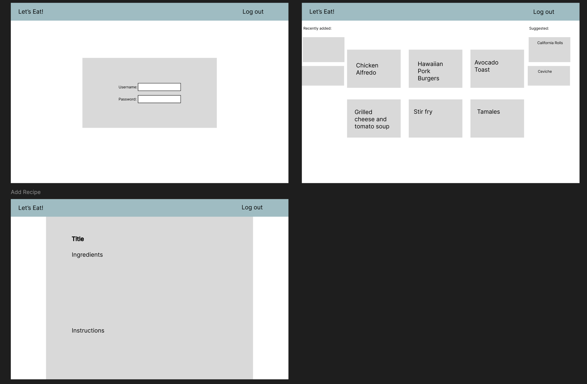

# Let's Eat!

[My Notes](notes.md)

Let's Eat is a site where you can add and access recipes from anywhere, as well as get suggestions on new recipes. This way there is no need to worry aobut forgetting to print or save a recipe and needing to find it again through a Google search. Perhaps later features can be added to allow sharing with specific people or uploading pictures and having the program create the recipe itself.

> [!NOTE]
> This is a template for your startup application. You must modify this `README.md` file for each phase of your development. You only need to fill in the section for each deliverable when that deliverable is submitted in Canvas. Without completing the section for a deliverable, the TA will not know what to look for when grading your submission. Feel free to add additional information to each deliverable description, but make sure you at least have the list of rubric items and a description of what you did for each item.

> [!NOTE]
> If you are not familiar with Markdown then you should review the [documentation](https://docs.github.com/en/get-started/writing-on-github/getting-started-with-writing-and-formatting-on-github/basic-writing-and-formatting-syntax) before continuing.

## 🚀 Specification Deliverable

> [!NOTE]
> Fill in this sections as the submission artifact for this deliverable. You can refer to this [example](https://github.com/webprogramming260/startup-example/blob/main/README.md) for inspiration.

For this deliverable I did the following. I checked the box `[x]` and added a description for things I completed.

- [x] Proper use of Markdown
- [x] A concise and compelling elevator pitch
- [x] Description of key features
- [x] Description of how you will use each technology
- [x] One or more rough sketches of your application. Images must be embedded in this file using Markdown image references.

### Elevator pitch

Have you ever really wanted a specific meal, but didn't have the recipe on hand? Maybe you were planning on making a meal this week, but can't remember what ingredients you need for it when you get to the grocery store. Let's Eat allows you to upload recipes, then pull access them whenever you need. No need to go search the internet for the right recipe. It's already saved and prepared for later.

### Design

### Key features

- Ability to enter in all of the ingredients and instructions for a recipe
- Login, logout, register
- Get notified when other people add a recipe
- Add a recipe
- View a suggested recipe

### Technologies

I am going to use the required technologies in the following ways.

- **HTML** - Build the structure of the site, 3 HTML pages -> login, my recipes, create recipe page
- **CSS** - Responsive Design, color schemes, lists to contain recipes
- **React** - Single page application with routing between views,
- **Service** - Endpoints for authentication, storing and retrieving recipes third party call for recipe suggestions
- **DB/Login** - Store authentication and recipes.
- **WebSocket** - Give recipe suggestions, notify the last two recipes added by other people

## 🚀 AWS deliverable

For this deliverable I did the following. I checked the box `[x]` and added a description for things I completed.

- [x] **Server deployed and accessible with custom domain name** - [My server link](https://lets-eat.click).

## 🚀 HTML deliverable

For this deliverable I did the following. I checked the box `[x]` and added a description for things I completed.

- [x] **HTML pages** - Created 3 pages. `index.html` for login, `recipes.html` to see all recipes, `new.html` to add a recipe, and `view.html` to view details of a recipe
- [x] **Proper HTML element usage** - I spent time experimenting with many different tags and utilized header, footer, main, a, input, img, and other elements in my code.
- [x] **Links** - Links between views and link to Github repo
- [x] **Text** - view.html page displays recipe as text with an image
- [x] **3rd party API placeholder** - Placeholder for suggested recipes from 3rd party API
- [x] **Images** - Added images for French Toast recipe
- [x] **Login placeholder** - Added placeholder for authentication on index.html
- [x] **DB data placeholder** - Placeholder with preview for recipe on recipes.html and recipe details on view.html
- [x] **WebSocket placeholder** - Placeholder for notifications about two most recent recipes added by other users

## 🚀 CSS deliverable

For this deliverable I did the following. I checked the box `[x]` and added a description for things I completed.

- [x] **Header, footer, and main content body** - used common `main.css` file to handle to style these, then added additional files to handle specific styling for each of the pages
- [x] **Navigation elements** - Utilized a Bootstrap navbar, including the navbar brand for the title.
- [x] **Responsive to window resizing** - Utilized Bootstrap and flex
- [x] **Application elements** - used flex and padding to help make sure everything lined up correctly
- [x] **Application text content** - used bootstrap to set text to font without serifs
- [x] **Application images** - Utilized images for on `view.html` and `recipes.html`

## 🚀 React part 1: Routing deliverable

For this deliverable I did the following. I checked the box `[x]` and added a description for things I completed.

- [x] **Bundled using Vite** - Easy to install and use vite
- [x] **Components** - Ported over all of my HTML and CSS, but it took some work, and I had to make some changes to my CSS files as a couple of my pages were not displaying how they should
- [x] **Router** - Routing between login and components for new recipe as well as viewing all recipes. Routing from all recipes to single recipe.

## 🚀 React part 2: Reactivity

For this deliverable I did the following. I checked the box `[x]` and added a description for things I completed.

- [x] **All functionality implemented or mocked out** - Used local storage to store recipe details including the dataURLs for the images. Mocked out the websocket with a timer. Used an array of recipes to mock out web service retrieving suggested recipes.
- [x] **Hooks** - Used the useEffect hook in most or all of my components to track various points of data

## 🚀 Service deliverable

For this deliverable I did the following. I checked the box `[x]` and added a description for things I completed.

- [ ] **Node.js/Express HTTP service** - I did not complete this part of the deliverable.
- [ ] **Static middleware for frontend** - I did not complete this part of the deliverable.
- [ ] **Calls to third party endpoints** - I did not complete this part of the deliverable.
- [ ] **Backend service endpoints** - I did not complete this part of the deliverable.
- [ ] **Frontend calls service endpoints** - I did not complete this part of the deliverable.

## 🚀 DB/Login deliverable

For this deliverable I did the following. I checked the box `[x]` and added a description for things I completed.

- [ ] **User registration** - I did not complete this part of the deliverable.
- [ ] **User login and logout** - I did not complete this part of the deliverable.
- [ ] **Stores data in MongoDB** - I did not complete this part of the deliverable.
- [ ] **Stores credentials in MongoDB** - I did not complete this part of the deliverable.
- [ ] **Restricts functionality based on authentication** - I did not complete this part of the deliverable.

## 🚀 WebSocket deliverable

For this deliverable I did the following. I checked the box `[x]` and added a description for things I completed.

- [ ] **Backend listens for WebSocket connection** - I did not complete this part of the deliverable.
- [ ] **Frontend makes WebSocket connection** - I did not complete this part of the deliverable.
- [ ] **Data sent over WebSocket connection** - I did not complete this part of the deliverable.
- [ ] **WebSocket data displayed** - I did not complete this part of the deliverable.
- [ ] **Application is fully functional** - I did not complete this part of the deliverable.
